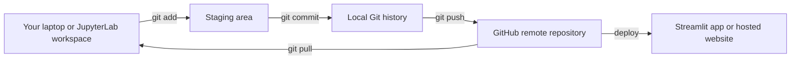
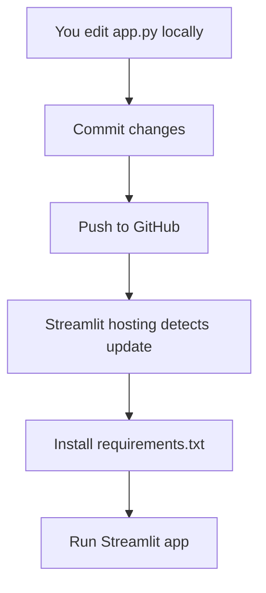
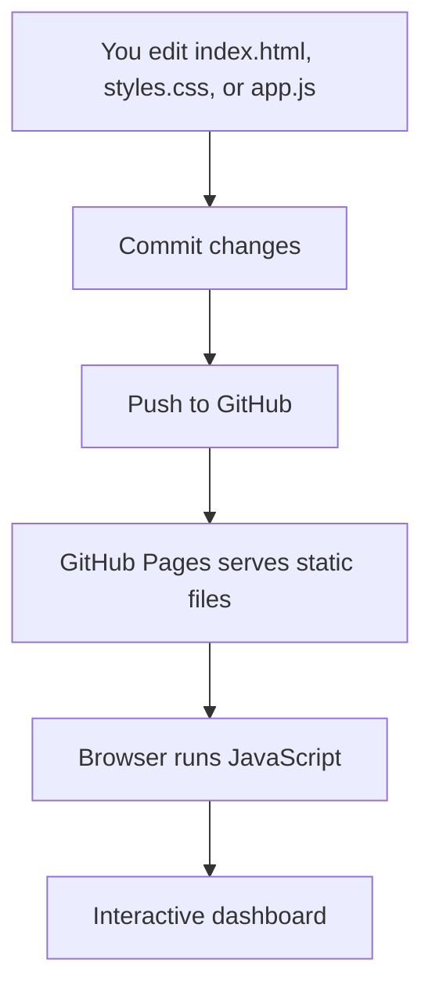
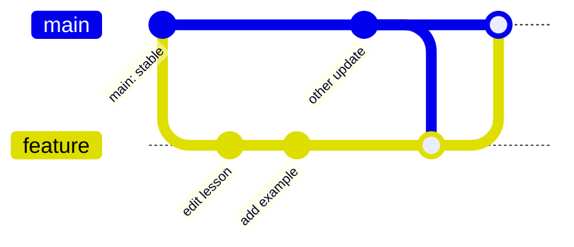

# Git and GitHub Tutoring for Beginners

This tutorial is for learners who know some Python, SQL, or data analysis, but have not yet learned Git. It starts from the terminal and builds toward real collaboration workflows: branches, pull requests, conflicts, Codex-assisted coding, and Streamlit hosting.

## Learning Goals

By the end, you should be able to explain and practice:

- What Git is and why developers use it
- What GitHub is and how it differs from Git
- How local files, commits, branches, and remote repositories connect
- How to clone a repository, edit files, commit changes, push, and pull
- Why `main` exists and why feature branches exist
- How collaboration creates conflicts and how to resolve them
- How Codex can help run Git commands and prepare changes
- How Streamlit hosting uses GitHub files such as `app.py` and `requirements.txt`
- How GitHub Pages can host static interactive dashboards with HTML, CSS, JavaScript, and Plotly

## Correct Mental Starting Point

Git is not a programming language. Git is a version control system. It records snapshots of your project over time, lets you experiment safely, and helps multiple people work on the same project without overwriting each other.

GitHub is not Git. GitHub is a website and cloud platform that stores Git repositories, displays code, manages collaboration, and connects code to tools such as deployment platforms.

## The Big Picture



A beginner mistake is thinking that saving a file is the same as committing it. Saving changes the file on disk. Committing records a named checkpoint in Git history.

## Four Practical Settings

### 1. Local or JupyterLab

You write code in notebooks or `.py` files, open a terminal, and run Git commands. JupyterLab usually includes a terminal if the environment allows it. On your own computer this usually works. On managed school or cloud platforms, terminal access depends on the platform settings.

### 2. Codex

Codex can inspect files, run tests, edit code, and prepare Git changes. You still need to understand Git so you can review what changed, decide what to commit, and know what gets pushed to GitHub.

### 3. Streamlit Hosting

Streamlit Community Cloud and similar services often read your GitHub repository directly. The hosting service looks for files such as `streamlit_app.py`, `app.py`, and `requirements.txt`, installs dependencies, and runs the app.



### 4. GitHub Pages Static Dashboards

GitHub Pages can host browser-only dashboards built with HTML, CSS, JavaScript, and Plotly. This is different from Streamlit because no Python server runs after deployment.



## Recommended Learning Path

1. Read [Lesson 1: Git Mental Model](lessons/01-git-mental-model.md)
2. Read [Lesson 2: Terminal and JupyterLab Workflow](lessons/02-terminal-jupyter-lab.md)
3. Read [Lesson 3: Branches, Main, and Collaboration](lessons/03-branches-collaboration.md)
4. Read [Lesson 4: Conflict Resolution](lessons/04-conflict-resolution.md)
5. Read [Lesson 5: Using Git with Codex](lessons/05-codex-workflow.md)
6. Read [Lesson 6: GitHub and Streamlit Hosting](lessons/06-streamlit-hosting.md)
7. Read [Lesson 7: Fork, Clone, and Classroom Workflow](lessons/07-fork-clone-classroom-workflow.md)
8. Read [Lesson 8: GitHub Pages and Static Interactive Dashboards](lessons/08-github-pages-static-dashboard.md)
9. Practice with the [Toy Streamlit Exercise](exercises/toy-streamlit-app/README.md)
10. Practice with the [GitHub Pages Model Performance Dashboard](pages/model-performance-dashboard/README.md)
11. Keep the [Git Command Cheatsheet](cheatsheets/git-command-cheatsheet.md) open while practicing

## Minimum Commands to Learn First

```bash
git clone <repo-url>
git status
git branch
git switch -c my-branch
git add <file>
git commit -m "Describe the change"
git push origin my-branch
git pull
```

Do not try to memorize every Git command. Start with the workflow and learn commands as tools for each step.

## Common Vocabulary

- Repository: a project tracked by Git
- Commit: a saved checkpoint in Git history
- Branch: a separate line of work
- Main: the default stable branch
- Remote: a copy of the repository on GitHub or another server
- Clone: download a remote repository to your computer
- Pull: bring remote changes into your local copy
- Push: send your local commits to the remote repository
- Pull request: a request to merge branch changes into another branch
- Conflict: a case where Git cannot automatically combine changes

## Why Branches Must Exist

If everyone commits directly to `main`, the shared project can break easily. Branches let people work independently, test their changes, review differences, and merge only when ready.



## What This Tutorial Does Not Assume

You do not need to know software engineering professionally. You do not need to understand rebase on day one. You do need to practice reading `git status`, making small commits, and reviewing changes before pushing.


## GitHub Pages Static Dashboard Demo

This branch also includes a serverless interactive dashboard demo:

```text
git-tutoring/pages/model-performance-dashboard
```

It uses HTML, CSS, JavaScript, and Plotly to show how GitHub Pages can host interactive charts, filters, sliders, metrics, and tables without running Python.

Expected Pages URL after enabling Pages from branch `git_tutoring` and folder `/root`:

```text
https://ladavid9989.github.io/data_science/git-tutoring/pages/model-performance-dashboard/
```

