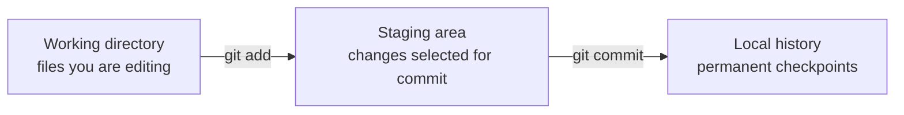

# Lesson 1: Git Mental Model

## What Problem Does Git Solve?

Imagine you are writing a data analysis project. You might create files like this:

```text
analysis.ipynb
clean_data.py
model.py
report.md
```

Without Git, you may end up with files like:

```text
report_final.md
report_final_revised.md
report_final_revised_real_final.md
```

Git replaces this messy habit with a real history of changes.

## The Three Local Areas



### Working Directory

This is your normal project folder. When you edit a Python file or notebook, you are changing the working directory.

### Staging Area

This is where you choose which changes should go into the next commit. Staging matters because one project folder may contain many edits, but a good commit should usually describe one logical change.

### Local History

This is the saved timeline of commits on your computer.

## GitHub Adds a Remote Copy


Git works locally. GitHub stores a shared copy online.

## Save vs Commit vs Push

| Action | What it means |
|---|---|
| Save | Write file changes to disk |
| Commit | Record a Git checkpoint locally |
| Push | Upload local commits to GitHub |

Saving a file does not update GitHub. Committing does not update GitHub. Pushing updates GitHub.

## Everyday Analogy

Think of Git like a lab notebook for code:

- A file save is a rough note on your desk.
- A commit is a dated lab notebook entry.
- A push is sending the notebook entry to the shared team archive.

## First Commands

```bash
git status
git log --oneline
```

Use `git status` constantly. It tells you where you are and what Git sees.

## Practice Questions

1. If you edit `app.py` but do not run `git add`, is it staged?
2. If you commit locally but do not push, can your teammate see it on GitHub?
3. Why might you stage only one file even if three files changed?
