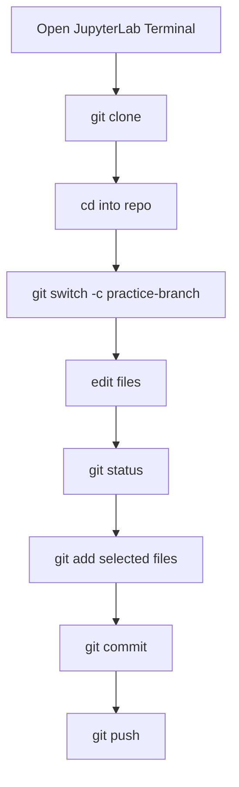

# Lesson 2: Terminal and JupyterLab Workflow

## Can You Use Git from JupyterLab?

Yes, if your JupyterLab environment provides terminal access. In local JupyterLab, this is usually available. In school, corporate, or cloud environments, terminal access may be disabled by policy.

In JupyterLab, look for:

```text
File > New > Terminal
```

or a Terminal icon in the launcher.

## Local Setup

Install Git from the official Git website if it is not already installed. Then open a terminal and check:

```bash
git --version
```

Set your identity once:

```bash
git config --global user.name "Your Name"
git config --global user.email "your.email@example.com"
```

These values label your commits.

## Clone a Repository

Cloning downloads a GitHub repository to your computer:

```bash
git clone https://github.com/<owner>/<repo>.git
cd <repo>
```

After cloning, inspect the project:

```bash
git status
ls
```

On Windows PowerShell, `ls` works as an alias. You can also use:

```powershell
Get-ChildItem
```

## Make a Small Change

1. Edit a file.
2. Check status.
3. Stage the file.
4. Commit it.
5. Push it.

```bash
git status
git add README.md
git commit -m "Update README introduction"
git push origin my-branch
```

## Recommended Beginner Habit

Run this before and after every meaningful action:

```bash
git status
```

It is the safest command in Git because it does not change anything.

## Notebook Warning

Jupyter notebooks are JSON files. Small visual notebook edits can create large text diffs. For collaboration, consider keeping important logic in `.py` files and using notebooks for exploration.

## Minimal Local Workflow


