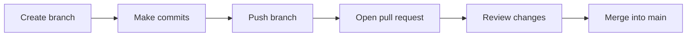

# Lesson 3: Branches, Main, and Collaboration

## What Is `main`?

`main` is usually the default stable branch. It should represent the version of the project that is most trusted.

## What Is a Branch?

A branch is a separate line of work. You create a branch when you want to make changes without disturbing `main`.

```bash
git switch -c add-chart-example
```

This creates a new branch and switches to it.

## Why Not Work Directly on Main?

In a solo toy project, working on `main` may seem fine. In a real project, direct changes to `main` are risky because they can break work for everyone.

Branches support:

- Experiments
- Code review
- Collaboration
- Safer deployment
- Easier rollback

## Pull Request Workflow

A pull request is a GitHub discussion about merging one branch into another.



## Compare Changes Before Merging

Useful commands:

```bash
git status
git diff
git log --oneline --graph --decorate --all
```

On GitHub, the Pull Request page shows file-by-file differences.

## Pull Before You Push

If other people are working in the same repository, update your local branch often:

```bash
git pull
```

If you are on a feature branch and need the latest main:

```bash
git switch main
git pull
git switch my-feature-branch
git merge main
```

This brings recent `main` updates into your branch.

## Rebase: What It Is, But Not Day One

Rebase rewrites a branch so it appears as if your work started from a newer point. It can create a cleaner history, but it is easier to misuse than merge.

Beginner recommendation:

- Learn merge first.
- Use rebase only when your course, team, or instructor asks for it.
- Do not rebase commits that other people are already using unless you understand the consequences.
