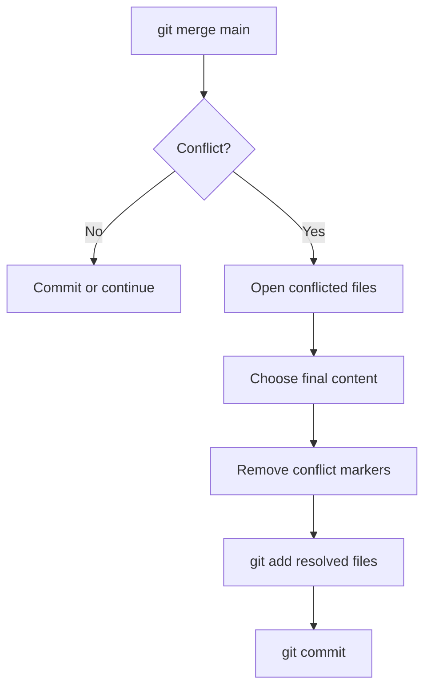

# Lesson 4: Conflict Resolution

## What Is a Conflict?

A conflict happens when Git cannot automatically combine changes. This often occurs when two people edit the same lines in the same file.

Example:

```text
<<<<<<< HEAD
This is your version.
=======
This is the other branch version.
>>>>>>> main
```

Git inserts markers so you can choose the final text.

## Conflict Workflow



## Simple Example

Two students edit `team_notes.md`.

Student A writes:

```text
Project focus: climate dashboard
```

Student B writes:

```text
Project focus: healthcare dashboard
```

Git cannot know which one is correct. A human must decide. The final version might be:

```text
Project focus: climate dashboard first, healthcare dashboard as a later extension
```

## Commands During a Conflict

```bash
git status
```

Git tells you which files are conflicted.

After editing the conflicted file:

```bash
git add team_notes.md
git commit
```

## Conflict Safety Rules

- Do not panic. A conflict is normal collaboration feedback.
- Read the whole conflicted section before editing.
- Remove all `<<<<<<<`, `=======`, and `>>>>>>>` markers.
- Run tests if the project has tests.
- Ask the other person if you do not understand why they made their change.

## How to Reduce Conflicts

- Make small commits.
- Pull frequently.
- Communicate before editing the same file.
- Split large documents or code into smaller files when practical.
