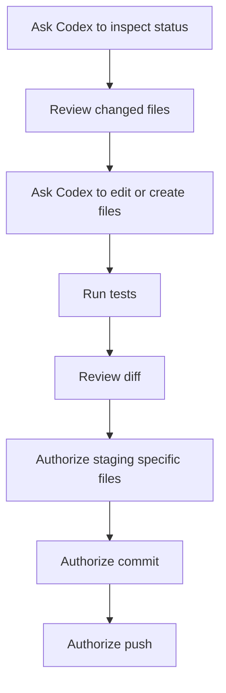

# Lesson 5: Using Git with Codex

## What Codex Can Help With

Codex can help you inspect a repository, edit files, run tests, summarize changes, and prepare commits. It is especially useful when you are learning because you can ask it to explain commands before running them.

Good requests:

```text
Explain what git status means in this repo.
```

```text
Create a new branch for my dashboard changes.
```

```text
Show me what files changed and summarize the diff.
```

```text
Run the tests, then tell me whether it is safe to commit.
```

## What You Still Need to Understand

Codex can run commands, but you own the repository. You should know:

- Which branch you are on
- Which files changed
- Which files should be committed
- Whether private data is accidentally included
- Whether the branch should be pushed

## Safe Codex Git Workflow



## Important Rule: Stage Specific Files

Avoid staging everything blindly. This is risky:

```bash
git add .
```

Prefer specific files:

```bash
git add README.md git-tutoring/README.md
```

Why? Because your folder may contain temporary files, private data, notebooks, generated outputs, or cache files.

## Questions to Ask Codex Before Pushing

```text
What branch am I on?
```

```text
What files are staged?
```

```text
Is any private or generated file included in the commit?
```

```text
Summarize the diff in plain English.
```

## Codex Is Not a Substitute for Git Basics

Codex makes Git easier, but it does not remove the need to understand the workflow. The best use of Codex is as a careful assistant: it can explain, inspect, and automate, while you make the final decisions.
