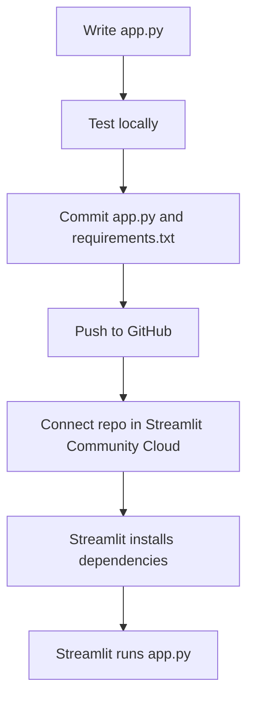

# Lesson 6: GitHub and Streamlit Hosting

## Why GitHub Matters for Hosting

Many hosting platforms deploy directly from GitHub. That means the files in your repository become the source for the running web app.

For Streamlit, a simple project often needs:

```text
app.py
requirements.txt
README.md
```

## Basic Streamlit Flow



## What Is `requirements.txt`?

It lists Python packages needed to run your app.

Example:

```text
streamlit
pandas
plotly
```

When the app is hosted, the platform reads this file and installs those packages.

## Local Test First

From the project folder:

```bash
pip install -r requirements.txt
streamlit run app.py
```

If it does not run locally, it probably will not run on hosting either.

## Common Hosting Problems

| Problem | Common cause |
|---|---|
| App cannot import package | Missing package in `requirements.txt` |
| File not found | Wrong file path or data file not committed |
| App works locally but not online | Local-only secret, absolute path, or missing dependency |
| Private data exposed | Sensitive file accidentally committed |

## Secrets

Do not commit API keys, passwords, or private files. Hosting platforms usually provide a secrets manager. Use that instead of writing secrets into code.

## GitHub Deployment Mental Model


If the GitHub repo is outdated, the hosted app is outdated. If the repo is missing a required file, the hosted app is missing it too.

## Beginner Exercise

Use the toy Streamlit project in:

```text
git-tutoring/exercises/toy-streamlit-app
```

Make a small text change, commit it on a branch, push it, and observe how GitHub shows the difference.
