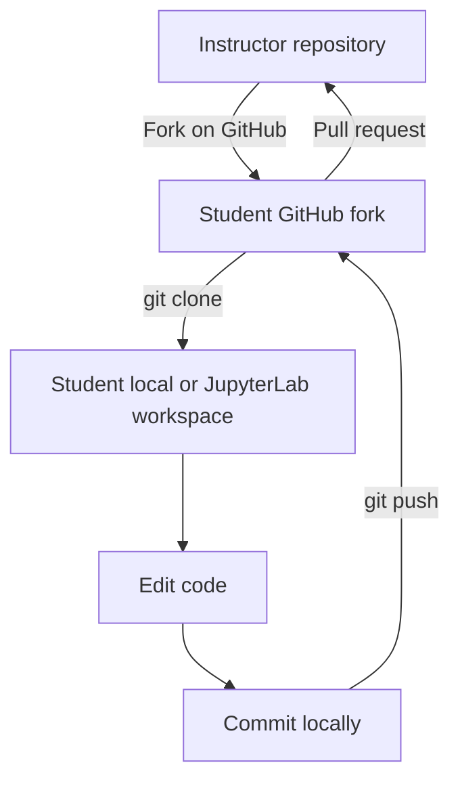
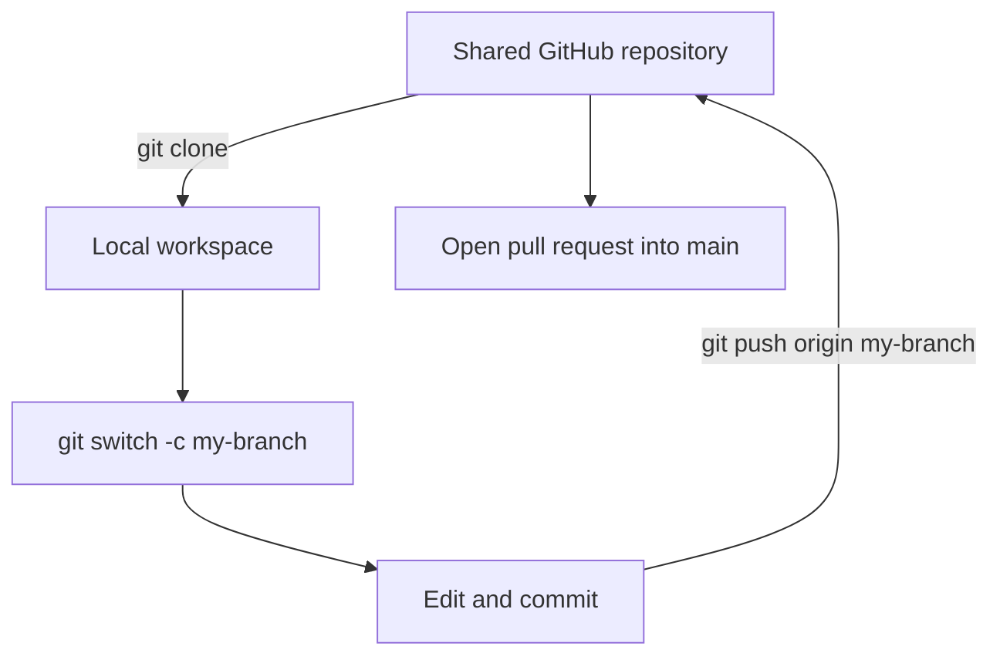
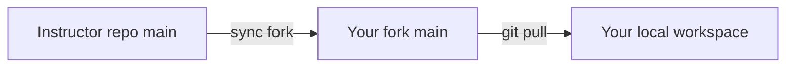

# Lesson 7: Fork, Clone, and Classroom Workflow

## Fork vs Clone

These two words are often confused.

| Action | Where it happens | Meaning |
|---|---|---|
| Fork | GitHub website | Make your own GitHub copy of someone else's repository |
| Clone | Your computer or JupyterLab terminal | Download a repository to your working environment |

A fork creates an online copy under your GitHub account. A clone creates a local working copy on your machine or cloud workspace.

## Typical Student Workflow



This is common when students do not have direct write access to the instructor's repository.

## If You Have Direct Branch Access

Sometimes a student or teammate can push a branch directly to the same repository.



This is common in a team project where everyone is a collaborator on the same repository.

## Compare on GitHub

GitHub can compare two branches and show exactly what changed. This is the foundation of code review.

Common comparisons:

```text
main compared with my-feature-branch
instructor main compared with student fork branch
```

The comparison page answers:

- Which files changed?
- Which lines were added?
- Which lines were removed?
- Can GitHub merge this automatically?
- Is there a conflict?

## Pull Request Etiquette for Beginners

A good pull request should include:

- What changed
- Why it changed
- How you tested it
- Any question for the reviewer

Example:

```text
Title: Add Streamlit chart example

Summary:
- Added a bar chart to the toy dashboard
- Added pandas and streamlit to requirements.txt

Test:
- Ran streamlit run app.py locally
```

## Keeping Your Fork Updated

If you fork a class repository, the instructor may continue updating the original repository. Your fork can become outdated.

Conceptually:



GitHub has a **Sync fork** button for many repositories. You can also do this in the terminal with an `upstream` remote, but that is a later lesson.

## Local JupyterLab Without Paid Cloud

You do not need AWS SageMaker to learn Git. Good beginner options include:

- Local JupyterLab on your own computer
- VS Code terminal
- Anaconda Prompt or PowerShell
- GitHub Codespaces if available through school or free quota

The important idea is not the platform. The important idea is that you have a terminal in a folder that contains a Git repository.
