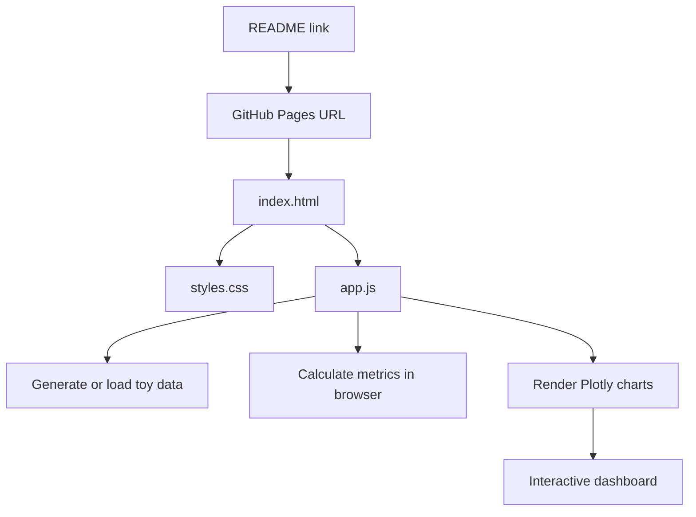
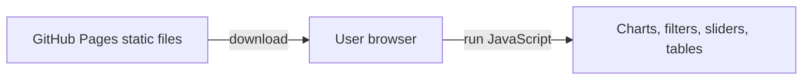

# Lesson 8: GitHub Pages and Static Interactive Dashboards

## What GitHub Pages Is

GitHub Pages is a static website hosting feature. It can serve files such as:

```text
index.html
styles.css
app.js
images
csv files
json files
```

It does not run a Python backend. That means GitHub Pages is a good fit for browser-only dashboards built with JavaScript, Plotly, Vega-Lite, D3, or plain HTML controls.

## Static Dashboard Architecture



## Why This Works Without a Server

The browser downloads the files from GitHub Pages and runs JavaScript locally in the user's browser.



No Python process is running. No database is running. No Streamlit server is running.

## GitHub Pages vs Streamlit

| Need | Better fit |
|---|---|
| Static HTML, CSS, JavaScript | GitHub Pages |
| Interactive Plotly chart in browser | GitHub Pages |
| Python data processing on every user action | Streamlit or another server |
| Private user login and database writes | Server app |
| Simple portfolio dashboard | GitHub Pages |

## Demo Project

The toy dashboard is here:

```text
git-tutoring/pages/model-performance-dashboard
```

Open the demo files:

```text
index.html
styles.css
app.js
```

The dashboard simulates a customer churn model. Learners can change:

- Model dropdown
- Segment dropdown
- Decision threshold slider

The page recalculates:

- AUC display
- Precision
- Recall
- F1
- Confusion matrix
- ROC curve
- Precision and recall chart
- Regional risk bubble chart
- High-risk customer table

## How to Enable GitHub Pages

In the GitHub repository:

1. Open repository Settings.
2. Open Pages.
3. Choose Deploy from a branch.
4. Choose branch `git_tutoring`.
5. Choose folder `/root`.
6. Save.

After GitHub builds the page, the dashboard URL should look like:

```text
https://ladavid9989.github.io/data_science/git-tutoring/pages/model-performance-dashboard/
```

If the URL does not work immediately, wait a minute and refresh. Pages deployment can take a little time.

## Local Practice Workflow

From the repository root:

```bash
git switch git_tutoring
git pull
cd git-tutoring/pages/model-performance-dashboard
python -m http.server 8000
```

Open:

```text
http://localhost:8000
```

Then edit one file, for example `app.js`, and practice:

```bash
git status
git diff
git add git-tutoring/pages/model-performance-dashboard/app.js
git commit -m "Update dashboard chart behavior"
git push origin git_tutoring
```

## What Students Should Notice

Changing a file locally does not change the website. The site changes only after:

1. Save the file.
2. Commit the change.
3. Push the commit to GitHub.
4. GitHub Pages redeploys the static files.

This makes GitHub Pages a useful teaching tool because students can see the full loop from local edit to remote hosted result.
