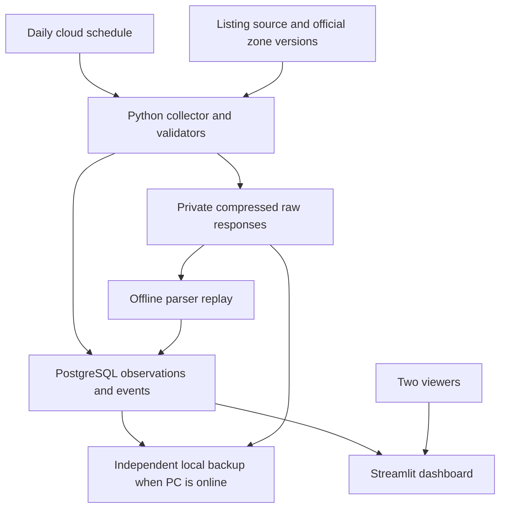

# School-zone housing tracker: implementation plan

Planning date: 2026-09-29. This is a proposed implementation, not a deployed service. Read [feasibility research](FEASIBILITY.md) and the [bounded Zillow experiment](ZILLOW_PROBE_2026-09-29.md) for prior evidence.

## 1. Agreed product scope

- Track North Gwinnett High School and Johns Creek High School attendance zones, using official boundaries rather than ZIP codes, city labels, or proximity to a school.
- Discover Houses / single-family homes with at least three bedrooms and two bathrooms across **all asking prices**. No construction-year acquisition filter.
- Default the dashboard price filter to USD 400,000-700,000 inclusive; users can expand it and filter by construction year and other recorded attributes.
- Preserve daily inventory observations, asking-price changes, construction years, listing episodes, and supported contract/sale events. Show both market aggregates and individual property timelines.
- Keep tracking independent of dashboard visits. Support approximately two viewers.
- Prefer zero recurring cost. The available local PC is not always on, so local scheduling alone does not meet unattended daily coverage.

Here, "whole market" means the two zones' qualifying Houses / 3+ bed / 2+ bath segment. It does not include every housing type or every home in the school zone, and any source coverage limitation must remain visible.

## 2. Evidence and outstanding gates

| Capability | Verified evidence | Still to verify |
| --- | --- | --- |
| Zillow search extraction | North Gwinnett local HTTP probe: 41 unique first-page rows matched Houses, 3+ beds, 2+ baths and USD 400k-700k; source reported 71 results on two pages | Both zones, all prices, all pages, stable pagination and cloud-network access; 71 is not the new universe's count |
| Construction year | All three inspected detail pages matched visible Built in text: 2000, 1998, 2000; use both property.yearBuilt and property.resoFacts.yearBuilt | Coverage over the complete universe and additional detail-page variants |
| Status | Saved first-page sample includes Active Under Contract; no additional Zillow requests were needed for this inspection | Normalization, explicit status filters, pending/sold examples and live transitions |
| Past transaction data | Saved detail objects include lastSoldPrice with a past sold date | Whether a later transaction belongs to the tracked listing episode; availability and lag of new closing prices |
| Geographic boundaries | Public Gwinnett and Fulton polygon queries succeeded; Fulton layer identifies FY2627 | Gwinnett effective school year, topology and official address checks; completeness of discovery inside each polygon |
| Unattended operation | Architecture can separate scheduler, persistent storage and UI | No hosted collector or multi-day pilot has run |

Additional offline inspection found 31 Active, two Active Under Contract, seven House for sale, and one New construction display labels in the 41-row sample. These labels require normalization; New construction is an attribute, not proof of a distinct sale status.

The inspected property 58607266 contains two price-history entries with dates/prices but no event-type field in those entries. Other inspected objects expose earlier sold dates and amounts. Do not infer a sale from an untyped history entry or treat lastSoldPrice as the closing price of the current listing.

[Zillow's terms](https://www.zillow.com/corporate/terms-of-use/) restrict automated queries. Successful local extraction establishes technical behavior, not permission for recurring collection. Ongoing source access and permitted use remain source-selection constraints. Do not use CAPTCHA bypasses or evasive proxies. Keep acquisition replaceable so manual imports or an authorized provider can use the same history and UI.

## 3. Recommended operating architecture



Use GitHub Actions for a short daily collection job, Supabase PostgreSQL for operational history, private object storage for raw evidence, and Streamlit Community Cloud for the UI. This is the preferred **pilot candidate**, conditional on source access from the hosted runner and measured free-tier usage.

| Component | Proposed use | Relevant limitation |
| --- | --- | --- |
| GitHub Actions | Standard Linux runner; daily 06:17 America/New_York; bounded transient-error recovery | Public standard runners are free. Schedules can be delayed/dropped; public schedules disable after 60 days without repository activity. Workflow must be on default branch, even if it checks out feature-branch code |
| Supabase Free | Private PostgreSQL tables and private raw-response bucket | 500 MB database, 1 GB file storage, 5 GB egress; inactivity pause after one week; automatic backups and PITR not included |
| Streamlit Community Cloud | Read dashboard data; cache by published run ID | Free hosting; sleeps after 12 hours without traffic. UI sleep must not affect ingestion |
| Local PC | Development, manual fallback, independent backup and offline replay | Cannot guarantee daily observations while powered off |

Sources: [Actions billing](https://docs.github.com/en/billing/concepts/product-billing/github-actions), [schedule behavior and timezone support](https://docs.github.com/en/actions/reference/workflows-and-actions/events-that-trigger-workflows#schedule), [Supabase pricing](https://supabase.com/pricing), [Community Cloud](https://docs.streamlit.io/deploy/streamlit-community-cloud), [app hibernation](https://docs.streamlit.io/deploy/streamlit-community-cloud/manage-your-app).

The feature branch is suitable for development. A scheduled workflow cannot operate solely from that branch; default-branch integration is a later deployment step. Do not merge or deploy as part of this planning task.

If the hosted source test fails, local collection can still upload observations when the PC is on, but that changes the coverage promise. Other choices are an always-on device or an accessible authorized provider within an agreed budget. There is currently no verified combination guaranteeing free, complete, unattended daily Zillow collection.

SQLite is appropriate for local development or a portable analysis export. Do not use an active SQLite file in OneDrive, a Git repository, an ephemeral runner, or the dashboard filesystem as the shared production database. The existing jobAgent module separation is reusable; its latest-value upserts and UI-triggered collection do not provide daily housing history.

## 4. Daily collection and publication

1. Create a run with scope version, zone version, parser version, query configuration and timestamps. Separate inventory discovery from lifecycle follow-up.
2. Query a verified geographic superset for each school, with the agreed house/bed/bath criteria and no price restriction. Explicitly declare active and contract-status coverage. The Zillow school "near" route alone does not prove geographic coverage. Split search areas if source limits prevent full enumeration; verify each partition rather than silently accepting truncated results.
3. Fetch all required pages under a bounded request budget. Record returned filters, reported counts, page identities, unique IDs and any relaxed/outside-scope results. Spatially classify coordinates against the official polygon; unresolved coordinates and boundary-edge cases remain separately flagged.
4. Store compressed responses and checksums before parsing. Extract observations and record missing fields without replacing valid earlier attribute observations with nulls.
5. Enrich newly discovered properties for construction year. Recheck changed, missing, pending or otherwise unresolved listings on a prioritized schedule. Preserve known years with observation provenance; periodically check corrections and new-construction updates instead of requesting every detail page every day.
6. Continue tracking known properties after a price/attribute change or disappearance from discovery. A property crossing the UI price band must not lose its history. Follow existing episodes into contract and sale states even when those listings leave the discovery query.
7. Validate and atomically publish each zone's completed inventory snapshot. Keep partial results as evidence, but exclude them from headline inventory changes and medians. Track detail-enrichment completeness separately so a missing year does not invalidate an otherwise complete inventory snapshot.
8. Derive events and aggregates from published observations. Two-zone comparisons use a common valid observation date, or clearly show the mismatch. The UI reads published data only.

An inventory search is observed over a time interval, not an instantaneous MLS snapshot. Reconcile source totals and page coverage with explicit exclusion counts and tolerances for concurrent changes. If reconciliation is unresolved, mark the run partial. A zero-result response is valid only after response/query validation; an HTTP or parser failure is never zero inventory.

Retries must be bounded and idempotent. Use a run ID, uniqueness constraints and atomic publication; repeated processing must not duplicate property observations or events. Keep all attempts and select one canonical complete snapshot per zone/day. A recovery job first checks whether that day's publication already exists.

Save observed_at in UTC and derive market_date in America/New_York. Preserve source event dates separately. A missed day stays missing: replay can repair a saved response, but today's page cannot reconstruct yesterday's inventory. Show last successful collection and gaps prominently. Do not interpolate unknown days into apparent observations.

Initial follow-up policy to evaluate in the pilot: daily checks for newly missing or contract-stage episodes, less frequent checks after persistent unknown/off-market status, and weekly checks for confirmed sold listings with no price for up to 180 days. End unresolved cases explicitly and allow later source updates. Request caps may delay enrichment; display this lag.

## 5. Persistence model

| Entity | Purpose |
| --- | --- |
| scope_versions / zone_versions | Query criteria, official boundary source, effective school year, geometry hash and membership rules |
| collection_runs / raw_objects | Start/end, complete/partial/failed state, coverage checks, response metadata, checksum, storage location, parser version |
| properties / attribute_observations | Stable internal ID, provider IDs such as zpid, address/coordinates, year built and other attributes with provenance |
| listing_episodes | Distinguish relistings of the same property using source listing IDs and dates where available; retain uncertain episode links |
| listing_observations | Append-only asking price, raw/normalized status, attributes, observed time, query membership and source evidence |
| source_events / transactions | Price/status/transaction facts, effective date if supplied, discovery time, evidence and associated episode |
| daily_aggregates | Rebuildable counts and distributions with scope/filter definition and valid denominators |

Separate latest-value convenience views from permanent observations. Corrections are versioned; an older incorrect parser output is retained as superseded, not silently rewritten. Raw replay records the new parser version and produces a new publication version.

Normalize status to active, under_contract, pending, sold, withdrawn only when explicitly supported, and off_market_unknown. Keep observation availability (observed, missing, stale) separate from sale status. Missing from search never means sold. Support pending returning to active and a later relisting after sale. Do not merge properties solely on a fuzzy address or pretend a zpid is a listing-episode ID.

Past sales can populate a source-history layer, with provenance and ingestion time. They do not recreate historical daily inventory. An initial active listing is baseline inventory, not automatically a new listing that day. Mark first-observed versus source-confirmed listing dates, and keep source days-on-market separate from days observed by this tracker.

## 6. Dashboard and metric definitions

Three primary views are sufficient for the first release:

1. **Market overview:** school selection, whole collected segment versus selected filters, date range, inventory trend, price distribution, construction-year distribution, contract/sale counts and data freshness.
2. **Listings:** sortable table and map with asking price, year built, beds/baths, area, source status, change since prior observation, first/last seen and source link. Missing construction year is visible and independently filterable.
3. **Property history:** observed price line, listing episodes, status changes, source transaction facts, dated evidence and observation gaps. Current price and past sale price are distinct fields.

| Metric | Definition and interpretation |
| --- | --- |
| Active inventory | Unique eligible episodes explicitly active in a complete snapshot; show under-contract/pending separately |
| Inventory change | Difference between comparable complete snapshots; distinguish query entry/exit, new observations and status changes |
| New listings | Source-supported new episodes where dates exist; report first-observed entries separately |
| Median asking price | Median within that date's selected inventory; always show sample size. A change can reflect a different mix of homes, not appreciation |
| Same-listing price changes | Compare asking prices within the same episode across valid observations; show count and denominator of comparable listings |
| Price per square foot | Distribution using valid positive area; display the number excluded for missing/invalid area |
| Construction year | Filter and histogram with a missing/unknown bucket and completeness percentage |
| Contract activity | Explicit supported transitions; observation time is not necessarily the contract-signing time |
| Sales | Confirmed source transactions linked to an episode; show sold date, price if available, and when we learned it |
| Time on market | Source-reported DOM and tracker-observed duration labeled separately; baseline listings have incomplete observed histories |

Evaluate historical filters against each date's recorded facts. For example, a USD 710k listing reduced to USD 690k enters the default price band but is not a new market listing. A later price reduction must not retroactively bring its earlier USD 710k observation into the historical USD 400k-700k count. Use facts known as of each publication by default; any corrected-history view must be explicitly labeled.

Keep market price distributions and within-property price changes together. A lower median can be caused by expensive homes selling or cheaper homes entering; it is not a repeat-sales price index. Use rolling 30/90-day sale summaries when transaction samples are small, and show reporting lag. Whole-market history begins with successful collection; older source events may appear in individual timelines without implying earlier inventory coverage.

## 7. Request volume, free-tier capacity and recovery

Daily request demand is approximately the sum of required discovery pages across all query partitions and statuses, plus new-property enrichment and scheduled lifecycle rechecks. The prior 71-result price-limited probe cannot estimate the newly agreed all-price scope. Measure actual page sizes and result limits before sizing the collector.

The main savings come from caching stable attributes, reusing saved responses and prioritizing detail checks. UI price filtering has no acquisition cost. Narrowing acquisition prices would reduce some page/detail traffic but would permanently lose the wider market history the user now wants.

Offline gzip measurements on saved samples were approximately 142 KB for one search page and 118-125 KB for two detail pages. As a hypothetical example, ten similarly sized search pages per day alone would consume about 0.52 GB per year, before detail pages, backups and metadata. This is not a measured daily workload. Measure normalized table/index growth and raw storage during the pilot and project 12-month usage; do not promise indefinite free retention.

Retain normalized history long term. Start with a proposed 90-day cloud raw-response window, adjusted to measured capacity, and archive older raw objects to independent local storage when the PC is online. Remove an old cloud object only after a checksum-verified archive exists. At capacity, surface the constraint and pause affected collection if necessary rather than silently discarding evidence or enabling paid service.

Use periodic database exports and raw-object manifests, with an independent copy downloaded when the PC is online. An export in the same cloud account is useful but not an independent backup. Target weekly local backups when available; show the actual latest backup age and the resulting possible data-loss window. Test a restore into an empty database and replay representative raw responses before calling recovery complete. Do not treat GitHub artifact retention or commits of an active database as permanent backup.

Application data and raw responses remain private even if source code is public. Keep collector write credentials in deployment secrets and use a restricted read-only database identity for the UI. For approximately two intended users, configure private access; if access must be restricted to exactly two accounts, add an authenticated email allowlist. Community Cloud viewers can invite other viewers, so platform invitation alone is not a strict two-person authorization boundary. See [sharing behavior](https://docs.streamlit.io/deploy/streamlit-community-cloud/share-your-app) and [Streamlit authentication](https://docs.streamlit.io/develop/concepts/connections/authentication).

## 8. Implementation stages and acceptance criteria

### Stage A: resolve acquisition and geography gates

- Confirm current official boundary versions and representative address assignments for both schools.
- Verify discovery coverage, all-price filters, active/contract semantics, pagination and duplicates for both zones.
- Test a small bounded request set from the intended cloud network, subject to the chosen source's access conditions. Do not extrapolate local HTTP success to hosted reliability.
- Obtain representative pending/sold data and validate event semantics. Record fields that are unavailable rather than promising sale-price coverage.
- Decide whether this source can support the operating mode before configuring daily collection.

### Stage B: implement durable collection

- Build Python source adapters, geography validation, schema migrations, run manifests, raw storage, immutable observations and atomic publication.
- Port the validated parsing behavior, including both construction-year paths; the existing PowerShell probe stays a manual diagnostic.
- Verify idempotency, duplicate pages, partial requests, parser changes, price-band entry/exit, missing-versus-sold handling and relisting identity with focused fixtures. Keep bulk private source HTML out of Git; commit minimal synthetic fixtures.
- Exercise backup, restore and replay before accumulating irreplaceable history.

### Stage C: implement dashboard and deployment configuration

- Build the three views, shared filters, definitions, sample sizes, gaps and freshness indicators.
- Configure read-only UI access and viewer authorization.
- Prepare the scheduled workflow, secrets list and deployment instructions. Default-branch integration and service setup happen as a concrete later deployment task.

### Stage D: run a 7-14 day pilot

- Measure complete/partial/failed runs per zone, source stability, unknown-year share, unresolved geography/status, requests, latency and storage growth.
- Verify collection while the dashboard is unopened and the local PC is off.
- Exercise a failed run and recovery without false inventory drops or duplicate events; verify restored counts and timelines against the originals.
- Publish coverage and capacity results. A pilot period does not guarantee a sale will occur; unobserved lifecycle transitions remain unverified even if fixture tests pass.

The first usable release requires complete comparable snapshots for both scopes, correct historical filtering, provenance for displayed changes, no missing-to-sold inference, protected viewer access, and a successful restore. Ongoing daily reliability and transaction coverage are measured properties, not assumptions.

## 9. Suggested repository layout

```text
housing-tracker/
  docs/                         # Research, plan, operating guide
  scripts/probe_zillow.ps1       # Existing bounded diagnostic
  src/housing_tracker/
    sources/                    # Replaceable acquisition and parsers
    geography.py
    collect.py
    validate.py
    storage.py
    events.py
    metrics.py
  migrations/
  tests/fixtures/               # Minimal synthetic cases, no bulk source dumps
  streamlit_app.py
  requirements.txt
.github/workflows/housing-collect.yml
```

This planning update adds documentation only. No new live Zillow requests, account creation, scheduled collection, dashboard deployment, paid service or data upload is part of it.
