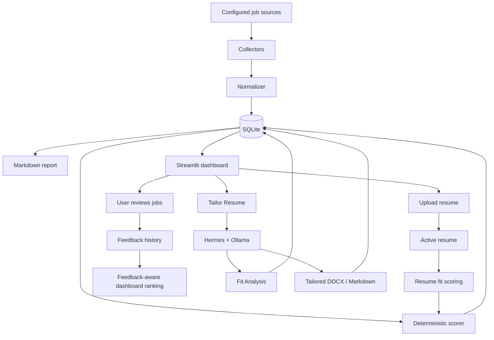
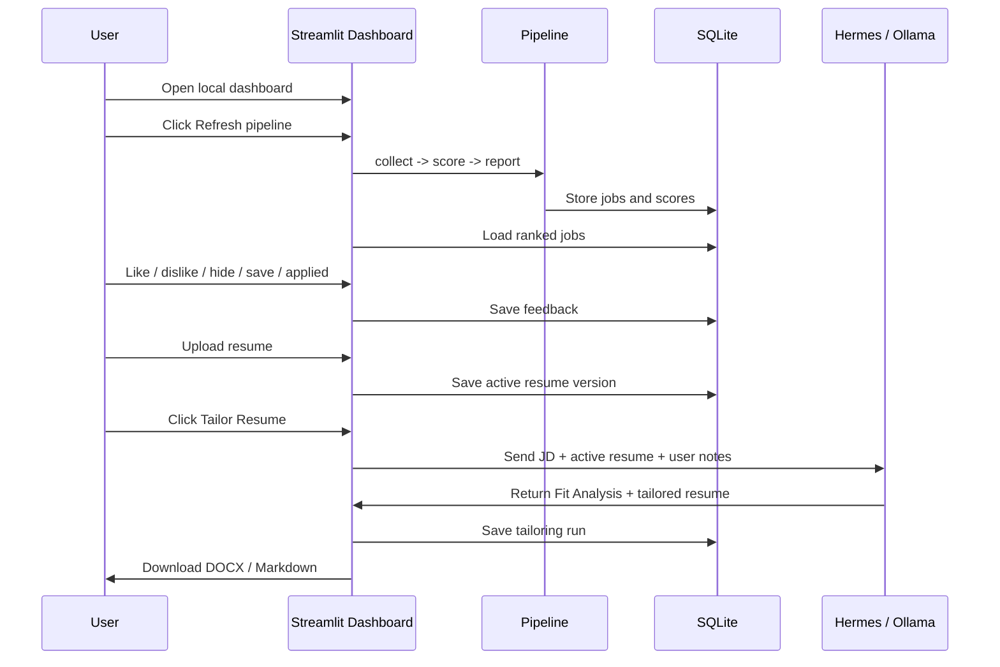

# job-agent

Local-first AI job matching dashboard for collecting job postings, ranking them against a user profile, capturing feedback, uploading a resume, and tailoring that resume to a selected job description with a local LLM.

All project Markdown is written in English so future handoffs stay compact, searchable, and easy to reuse.

## What This Project Does

`job-agent` helps a user run a private daily job search loop:

1. Collect jobs from crawler-friendly sources such as Greenhouse, Lever, Ashby, local files, and optional SerpApi Google Jobs.
2. Normalize postings into one common job model.
3. Store jobs, scores, feedback, resumes, and tailoring runs in local SQLite.
4. Score jobs by role, location, skills, freshness, resume fit, and feedback history.
5. Review ranked jobs in a local Streamlit dashboard.
6. Upload a resume in DOCX/PDF/TXT/MD format.
7. Ask Hermes, the local Ollama-backed LLM workflow, to tailor the active resume to a selected job description.
8. Download tailored resume drafts as DOCX or Markdown.

The current profile is tuned for Georgia / Remote US individual contributor data roles, but the YAML configuration can be adapted to other roles, locations, and skill profiles.

## Quick Start

Clone the repository and check out the `jobAgent` branch:

```powershell
git clone https://github.com/ladavid9989/data_science.git
cd data_science
git checkout jobAgent
```

If the app is inside a subfolder after cloning, move into that folder before running commands:

```powershell
cd job-agent
```

Create and activate a Python environment:

```powershell
conda create -n job-agent python=3.11 -y
conda activate job-agent
python -m pip install -r requirements.txt
```

Run tests:

```powershell
python -m pytest
```

Run the full pipeline:

```powershell
python run.py run-all
```

Open the dashboard:

```powershell
streamlit run streamlit_app.py
```

Then open the local URL shown by Streamlit, usually:

```text
http://localhost:8501
```

## Local LLM Setup

Hermes uses Ollama locally. This keeps resume data on the user's machine and avoids hosted LLM API cost during local use.

Install Ollama:

```powershell
winget install --id Ollama.Ollama --source winget
```

Pull the default model:

```powershell
ollama pull qwen2.5:7b
```

Verify Ollama is running:

```powershell
ollama list
```

Default local LLM settings live in [config/config.yaml](config/config.yaml):

```yaml
llm:
  enabled: true
  provider: "ollama"
  base_url: "http://127.0.0.1:11434"
  model: "qwen2.5:7b"
```

## System Flow



## Main User Workflow



## Project Structure

```text
job-agent/
  config/
    config.yaml          # Runtime settings, reporting thresholds, Ollama, tailoring
    sources.yaml         # Job source definitions
    user_profile.yaml    # Role, skill, location, salary, and scoring preferences
  data/
    sample_jobs/         # Safe sample postings for tests and smoke runs
    profile/             # Local private resumes and tailored outputs, ignored by git
    job_agent.sqlite3    # Local SQLite database, ignored by git
  docs/
    ARCHITECTURE.md      # Detailed module and data-flow explanation
    USER_GUIDE.md        # End-user setup and usage manual
    PICKUP_NOTES.md      # Development handoff notes
  output/
    ranked_jobs.md       # Generated report, ignored by git
  src/
    collectors.py        # Local file, Greenhouse, Lever, Ashby, SerpApi collectors
    normalizer.py        # Raw payloads -> Job dataclass
    scorer.py            # Deterministic role/location/skill scoring
    resume.py            # Resume upload, extraction, keyword fit, score adjustment
    feedback.py          # Feedback-aware ranking adjustment
    freshness.py         # Posted-date normalization and freshness categories
    memory.py            # SQLite schema and persistence functions
    reporter.py          # Markdown report generation
    llm.py               # Ollama client
    tailoring.py         # Hermes resume tailoring workflow
    pipeline.py          # Orchestration
    emailer.py           # Optional SMTP report delivery
    utils.py             # Shared helpers
  tests/
    test_*.py
  run.py                 # CLI entry point
  streamlit_app.py       # Local dashboard
  requirements.txt
```

## Configuration Files

Edit [config/user_profile.yaml](config/user_profile.yaml) to change the target role, skills, industries, salary, and location preferences.

Edit [config/sources.yaml](config/sources.yaml) to change where jobs are collected from.

Edit [config/config.yaml](config/config.yaml) to change report thresholds, freshness windows, resume scoring weights, Ollama settings, and output paths.

## Dashboard Features

- Refresh the full pipeline on demand.
- View ranked jobs after strict location and freshness gates.
- Filter by score, source, and location text.
- Open original job links.
- Show matched skills, missing skills, positive reasons, negative reasons, and description preview.
- Save feedback: like, dislike, hide, save, applied.
- Capture a dislike reason for future ranking adjustment.
- Upload and version resumes.
- Download the original uploaded resume.
- Show keyword-based resume fit.
- Tailor the active resume to a selected JD using local Ollama.
- Download tailored resume drafts as DOCX or Markdown.

## Data Privacy

Local private data is intentionally ignored by git:

- SQLite databases
- uploaded resumes
- extracted resume text
- generated tailored resumes
- generated reports
- `.env` files

Do not commit files under `data/profile/`, local SQLite databases, or generated reports.

## Detailed Documentation

- [User Guide](docs/USER_GUIDE.md)
- [Architecture](docs/ARCHITECTURE.md)
- [Pickup Notes](docs/PICKUP_NOTES.md)

## Current Limits

- Base ranking is still mostly deterministic and rule-based.
- Hermes is currently user-triggered only; it is not an autonomous agent.
- LLM semantic reasoning is used for resume tailoring, not broad ranking yet.
- Job source coverage is incomplete and should be expanded.
- Freshness data depends on what each source exposes.
- Streamlit download interactions may reset the Tailor Resume dialog; the next UI improvement should keep the Evidence Map visible after download.
- Hosted multi-user deployment is not implemented.

## Hosted Product Considerations

The project is local-first today. A hosted version would need:

- user authentication
- per-user source configuration
- per-user encrypted resume storage
- remote LLM API or a local/desktop companion
- billing or usage limits for LLM calls
- stronger privacy and retention controls
- better data sourcing beyond hand-curated ATS boards

The practical hosted path is likely a configurable personal job assistant, not a general-purpose job board replacement.
