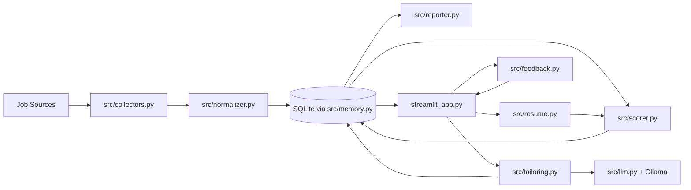
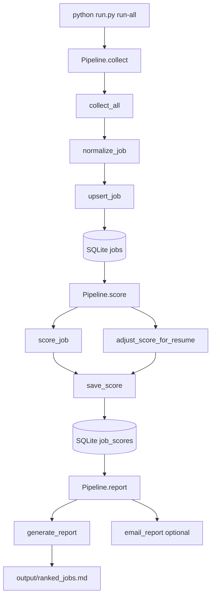
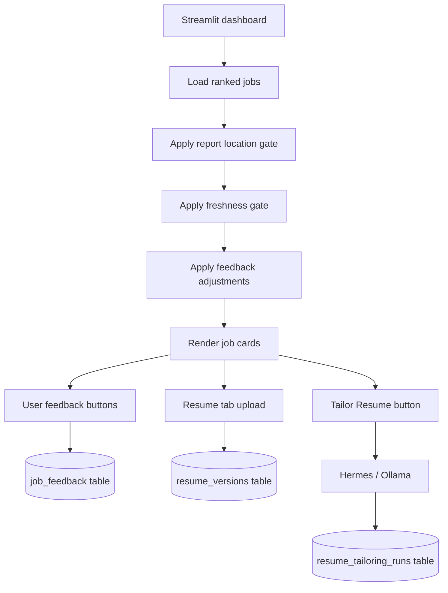
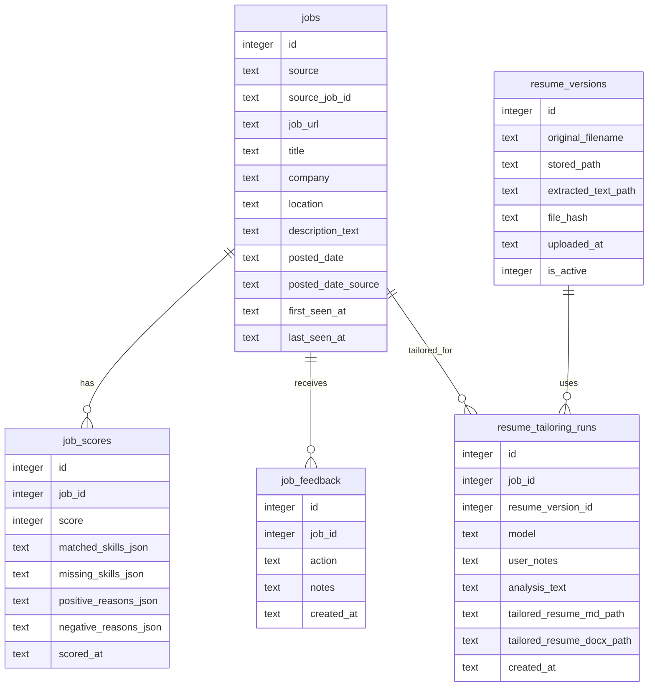

# Architecture

This document explains how `job-agent` works internally. It is for developers and future contributors who need to understand the moving parts before changing the system.

## High-Level Architecture



## CLI Pipeline

The CLI entry point is [run.py](../run.py).



`run-all` runs collection, scoring, report generation, and optional email delivery.

Individual commands:

```powershell
python run.py collect
python run.py score
python run.py report
python run.py email-report
```

## Dashboard Path

[streamlit_app.py](../streamlit_app.py) loads ranked jobs from SQLite and applies feedback-aware display ranking.



For performance, the dashboard loads a lightweight ranked job list. It does not load full job descriptions for every job on every click. Full descriptions are fetched only when the user opens details or starts `Tailor Resume`.

## Module Map

| File | Responsibility |
|---|---|
| [src/collectors.py](../src/collectors.py) | Collect raw jobs from local files, Greenhouse, Lever, Ashby, and optional SerpApi Google Jobs. |
| [src/normalizer.py](../src/normalizer.py) | Convert source-specific payloads into the shared `Job` dataclass. |
| [src/scorer.py](../src/scorer.py) | Score role fit, skill fit, location fit, seniority, salary, and negative keywords. |
| [src/resume.py](../src/resume.py) | Extract DOCX/PDF/TXT/MD resume text, store resume versions, compute keyword fit, and adjust scores. |
| [src/feedback.py](../src/feedback.py) | Apply cumulative like/dislike/hide/save/applied feedback to dashboard ranking. |
| [src/freshness.py](../src/freshness.py) | Normalize posted dates and classify jobs as fresh, recent, aging, stale, or unknown. |
| [src/memory.py](../src/memory.py) | Own SQLite schema and persistence helpers. |
| [src/reporter.py](../src/reporter.py) | Generate `output/ranked_jobs.md` with report gates and source summary. |
| [src/llm.py](../src/llm.py) | Call local Ollama through its HTTP API. |
| [src/tailoring.py](../src/tailoring.py) | Build Hermes prompts, generate Fit Analysis and tailored resume drafts, save Markdown/DOCX outputs. |
| [src/pipeline.py](../src/pipeline.py) | Orchestrate collect, score, report, and email steps. |
| [streamlit_app.py](../streamlit_app.py) | Render the local dashboard and interactive workflow. |

## SQLite Tables



## Scoring Layers

The score is built in layers:

1. Title and role fit from `src/scorer.py`.
2. Required and preferred skill matches.
3. Industry matches.
4. Georgia / Remote US location preference.
5. Non-US and unwanted onsite penalties.
6. Seniority and salary checks.
7. Negative keyword penalties.
8. Active resume keyword fit from `src/resume.py`.
9. Dashboard-only feedback adjustment from `src/feedback.py`.

The report uses stored scores. The dashboard uses stored scores plus feedback-aware display adjustment.

## Freshness Logic

Freshness is classified in [src/freshness.py](../src/freshness.py).

| Category | Meaning |
|---|---|
| `fresh` | Posted within 7 days. |
| `recent` | Posted within 21 days. |
| `aging` | Posted within 45 days. |
| `stale` | Older than 45 days. |
| `unknown_recently_seen` | No source posted date, but first seen locally within 14 days. |
| `unknown` | No reliable source posted date. |

`first_seen_at` is not the public posting date. It only means the first time `job-agent` stored that job locally.

## Hermes Tailoring

Hermes is implemented in [src/tailoring.py](../src/tailoring.py). It is intentionally user-triggered.

Input:

- selected job title, company, location, and description
- active resume text
- user guidance from the dialog
- local Ollama model from [src/llm.py](../src/llm.py)

Output:

- Fit Analysis
- Evidence Map
- Gaps / Do Not Overclaim
- Recommended Emphasis
- tailored resume Markdown
- tailored resume DOCX

Hermes should tailor, not invent. It may rephrase and emphasize evidence from the resume, but it should not create unsupported claims.

## Privacy Boundary

The local-first version keeps sensitive data on the user's computer:

- resume files
- extracted resume text
- tailored resume drafts
- SQLite database
- feedback history

These files are ignored by git.

## Hosted Deployment Questions

A hosted version would need a different architecture:

- authentication
- encrypted per-user resume storage
- per-user source configuration
- LLM API cost controls
- rate limits
- data deletion and retention policy
- stronger monitoring and abuse controls

The current architecture is best treated as a local-first prototype and personal assistant.
